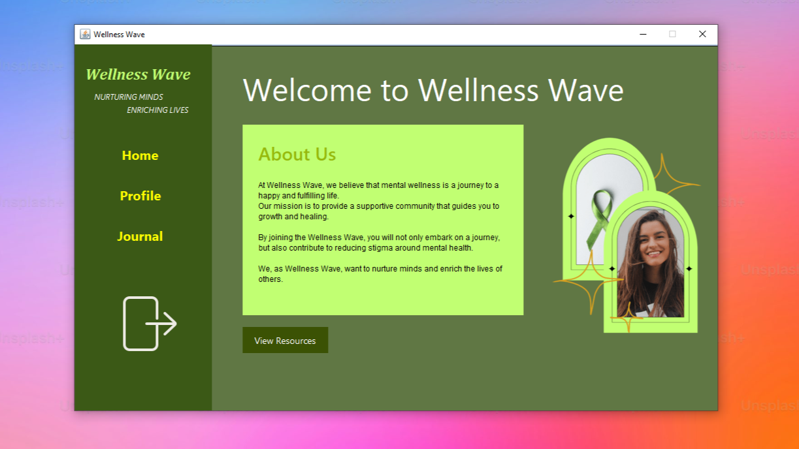
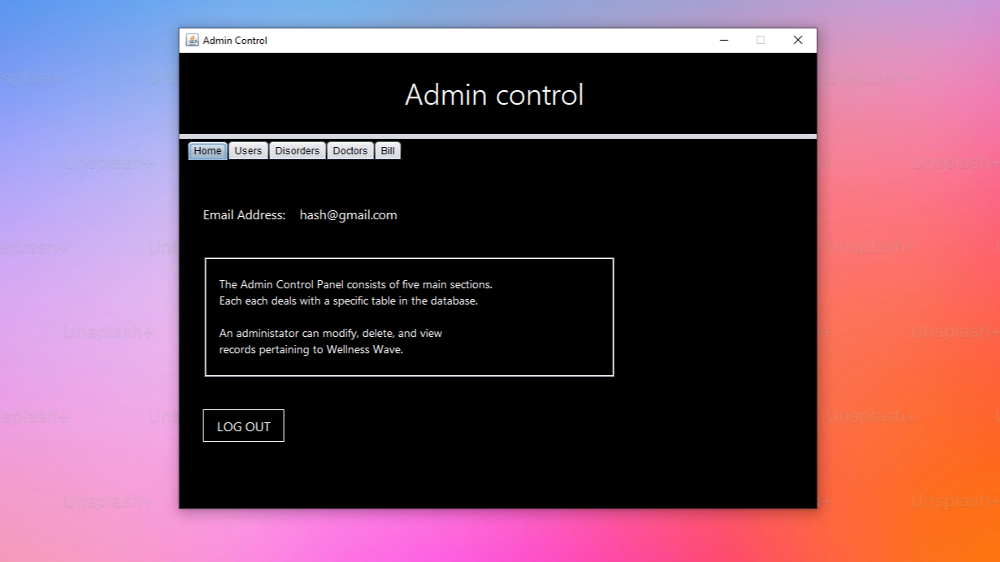
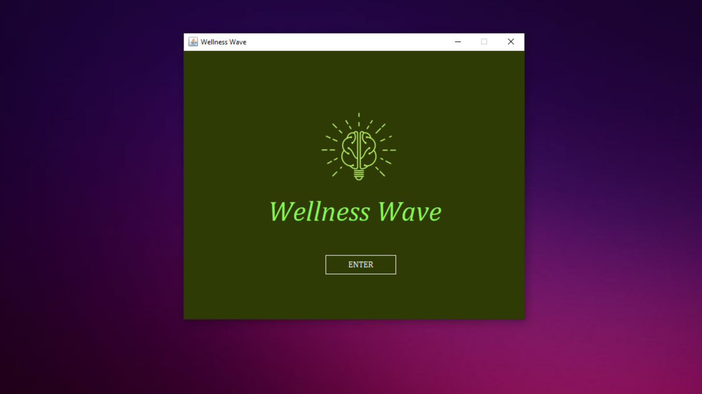
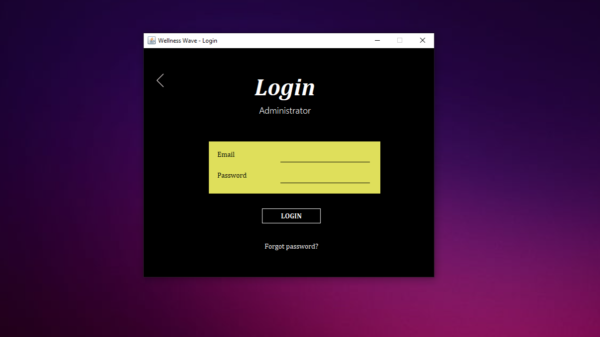
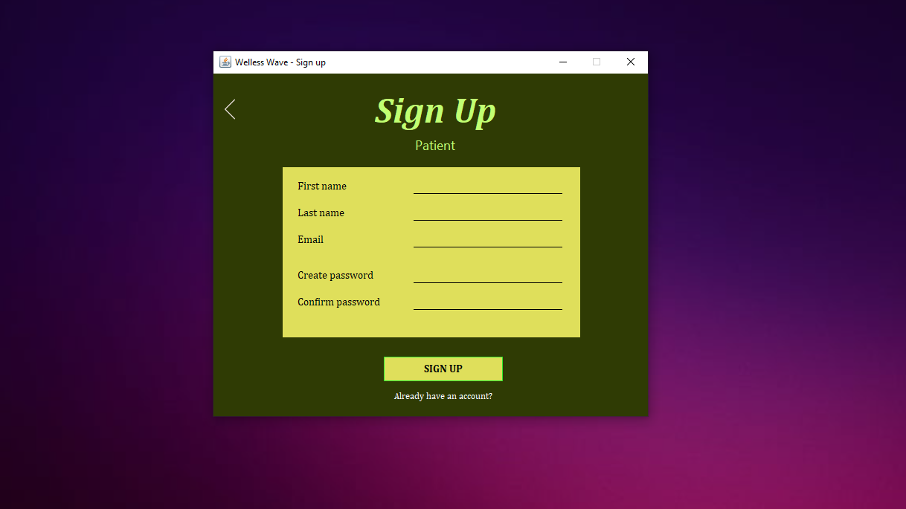

# Program:	Wellness Wave
__Description__ 	
> _Desktop app to help people with mental-health challenges_
- Started:	06.05.24
- Updated: 	07.10.24
- Status:	COMPLETE

- Developers
	* https://github.com/kyran-325
	* https://github.com/JoshuaTwigg
	* https://github.com/PrincessUgbobuaku
	* https://github.com/BugAches
	* https://github.com/MissBabyRose28
	* https://github.com/R-F-X
---
<!-- testing the comment -->

### More details about the application
###### This app was created using Java, Java Swing GUI components, and Apache Derby
---

### Screenshots

